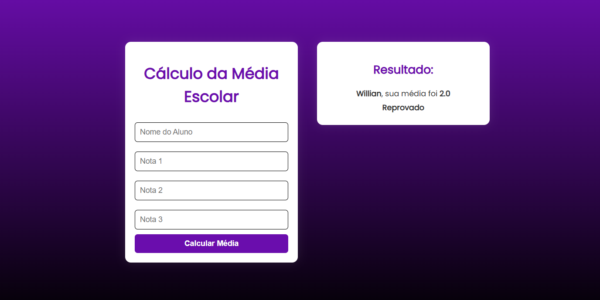

# 📘 Calculadora de Média Escolar

Este é um projeto simples desenvolvido em Python que permite ao usuário inserir três notas e, com base na média aritmética, exibe sua situação escolar:

- ✅ Aprovado
- ⚠️ Recuperação
- ❌ Reprovado

---

## 🎯 Funcionalidades

- Entrada do nome do aluno
- Entrada de 3 notas (float)
- Cálculo da média aritmética
- Exibição da média com 2 casas decimais
- Verificação da situação com base na média:
  - Média ≥ 7 → Aprovado
  - Média ≥ 5 e < 7 → Recuperação
  - Média < 5 → Reprovado

---

## ▶️ Como executar o projeto

## 1. Clone este repositório:
git clone https://github.com/Willrdev/calculadora_media_escolar.git

cd calculadora_media_escolar

python media_escolar.py

## 💡 Exemplo de uso

Qual o seu nome? Willian
Qual seria a nota 1? 6.5
Qual seria a nota 2? 7.0
Qual seria a nota 3? 8.0

Willian, sua média foi 7.17
Aprovado

## Resultado

  

## 🧑‍💻 Autor
Feito com dedicação por Willian
🔗 github.com/Willrdev